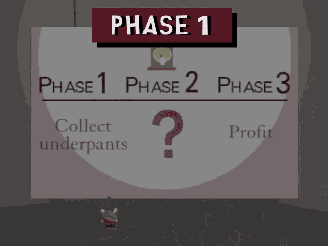
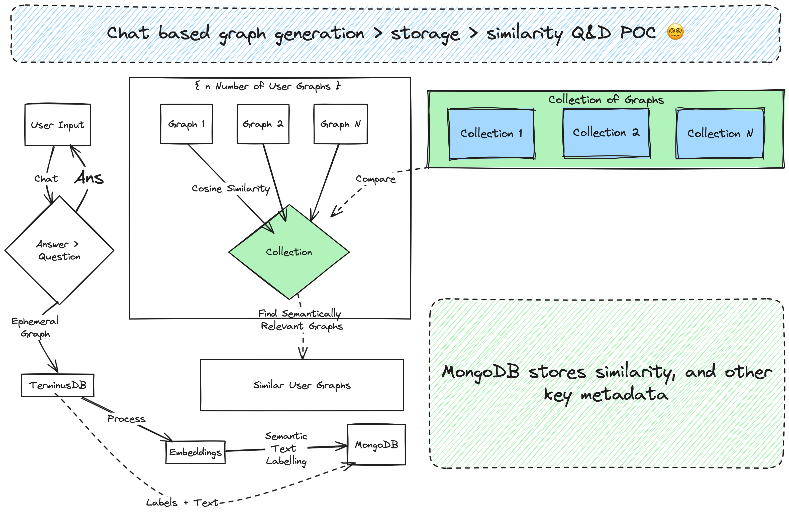

# Synapse Q&D POC 🤗🤗🤗

Streamlit Template Available @ w/ Thanks [frog-land GH](https://github.com/frog-land/Chat2VIS_Streamlit)

```
| Quick and dirty POC with Streamlit and Chat Interface ie.
  Build, Panic, Repeat Edition |

- Py3
- TerminusDB
- MongoDB
- Weaviate
- Luck 
```


### TL;DR



```yaml
***Phase 1:*** Use Chat UI w/ Streamlit 

***Phase 2:*** ????? something something TerminusDB something something Metadata Filtering.

***Phase 3:*** Synapse Chat Based Ephemeral Graph Success.

***Phase 4:*** Formalize Ephemeral Graph Generation as a Product.
```

### Quick (Inaccurate) Excalidraw Concept Diagram




